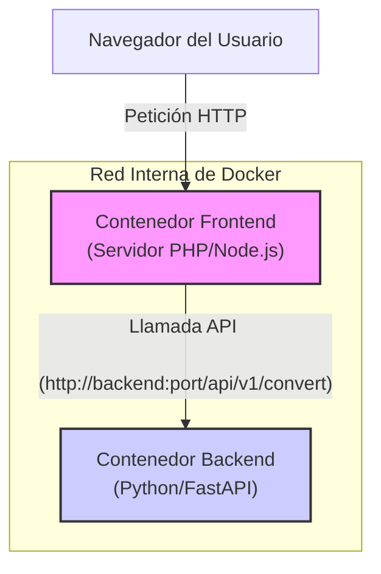
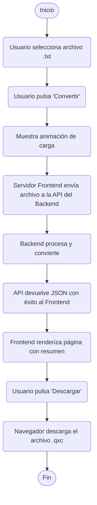

# Documento de Arquitectura: Conversor Picolo a QLC+

## 1. Diagrama de Arquitectura del Sistema

El sistema sigue una arquitectura de servicios desacoplados donde el contenedor del Frontend actúa como intermediario para el usuario, comunicándose con el Backend a través de una red interna.



## 2. Flujo de Datos Principal (Conversión Exitosa)

1.  **Petición Inicial:** El **Contenedor Frontend** sirve la página HTML con el formulario de subida.
2.  **Selección y Validación en Frontend:** El usuario selecciona un archivo. El código JavaScript del frontend realiza una **validación instantánea** para verificar que la extensión es `.txt` y que el tamaño no excede el límite preconfigurado. Si el archivo es inválido, se muestra un error inmediato y se detiene el proceso.
3.  **Envío del Formulario:** Si la validación en cliente es exitosa, el usuario envía el formulario. El navegador envía el archivo al servidor del Contenedor Frontend.
4.  **Validación en Servidor Frontend y Llamada API:** El servidor del Frontend recibe el archivo del navegador. Realiza una **segunda validación** (adicional a la del cliente) para confirmar el tipo y tamaño del archivo. Si es válido, crea una nueva petición `POST` y envía el archivo al servicio Backend a través de la red interna de Docker. Si la validación falla aquí, el Frontend devuelve un error al usuario.
5.  **Re-validación y Procesamiento en Backend:** El Contenedor Backend recibe la petición y realiza su propia **validación de seguridad**, repitiendo las comprobaciones de tipo y tamaño. Si la validación es correcta, procesa el archivo y genera el XML.
6.  **Respuesta al Contenedor Frontend:** El Backend devuelve la respuesta JSON (`200 OK` o un error) al servidor del Frontend.
7.  **Renderizado de la Respuesta:** El servidor del Frontend renderiza una nueva página HTML con el resumen de la conversión.
8.  **Respuesta al Usuario:** El Frontend envía esta nueva página al navegador del usuario.
9.  **Descarga del Archivo:** El usuario hace clic en un enlace de descarga, que solicita el archivo al servidor Frontend para iniciar la descarga.

## 3. Mapeo de Endpoints y APIs

Solo existe un endpoint principal para la funcionalidad de la aplicación.

*   **Endpoint:** `POST /api/v1/convert`
*   **Descripción:** Recibe un archivo de show de Picolo, lo procesa y devuelve el resultado de la conversión.
*   **Request:**
    *   **Tipo:** `multipart/form-data`
    *   **Campo:** `file`: El archivo `.txt` a convertir.
*   **Response (Éxito `200 OK`):**
    *   **Content-Type:** `application/json`
    *   **Cuerpo:**
        ```json
        {
          "summary": {
            "cueCount": 52,
            "channelCount": 48,
            "scenes": [
              { "id": 0, "name": "1.0 Escena de Inicio" },
              { "id": 1, "name": "2.0 Apagón" }
            ]
          },
          "fileName": "show_convertido.qxc",
          "fileContent": "<?xml version=\"1.0\" encoding=\"UTF-8\"?>..."
        }
        ```
*   **Response (Error `400 Bad Request` o `500 Internal Server Error`):**
    *   **Content-Type:** `application/json`
    *   **Cuerpo:**
        ```json
        {
          "error": "Mensaje descriptivo del error (ej: 'El archivo excede el tamaño máximo permitido.')"
        }
        ```

## 4. Estructura de Carpetas Propuesta

```
/convert2QLC/
├── .gitignore
├── docker-compose.yml
├── backend/
│   ├── Dockerfile
│   └── src/
│       ├── main.py         # Punto de entrada de la API (FastAPI)
│       ├── converter/      # Módulo para la lógica de conversión
│       │   ├── __init__.py
│       │   ├── parser.py
│       │   ├── transformer.py
│       │   └── generator.py
│       └── tests/          # Pruebas unitarias
│           ├── test_parser.py
│           └── test_transformer.py
└── frontend/
│   ├── Dockerfile
│   ├── package.json
│   └── src/                # Código fuente de la SPA (Vue.js/React)
└── docs/
    ├── project-architecture.md
    ├── project-plan.md
    └── project-specs.md
```

## 5. Patrones Arquitectónicos Aplicados

*   **Arquitectura de Microservicios:** La separación del `Frontend` y el `Backend` en servicios independientes y contenerizados permite un desarrollo, despliegue y escalado autónomo.
*   **Backend for Frontend (BFF):** El Contenedor Frontend actúa como un BFF. No contiene la lógica de negocio principal (que reside en el backend), sino que maneja las interacciones del usuario, se comunica con el servicio de backend y prepara los datos para su visualización.
*   **API RESTful:** El Backend expone su funcionalidad a través de una API sin estado (stateless) basada en HTTP, diseñada para ser consumida por otros servicios, no directamente por el navegador.

## 6. Diagramas de Flujo de Usuario

### Flujo de Conversión Exitosa



