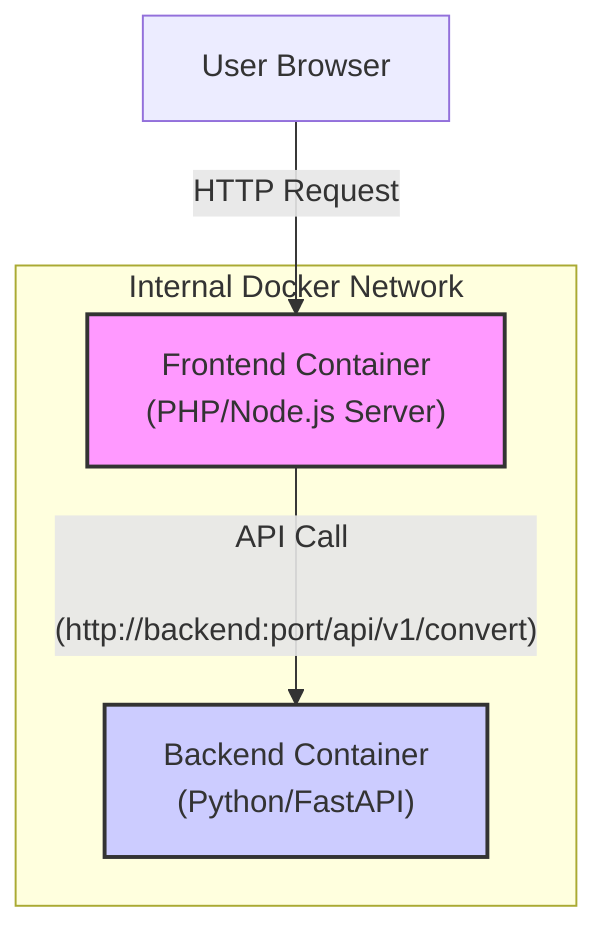
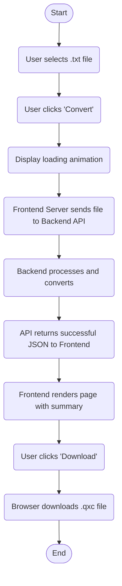

# Architecture Document: Picolo to QLC+ Converter

## 1. System Architecture Diagram

The system follows a decoupled services architecture where the Frontend container acts as an intermediary for the user, communicating with the Backend via an internal network.



## 2. Main Data Flow (Successful Conversion)

1.  **Initial Request:** The **Frontend Container** serves the initial HTML page with the upload form.
2.  **Selection and Frontend Validation:** The user selects a file. The frontend JavaScript performs **instant validation** to check for a `.txt` extension and that the size does not exceed a pre-configured limit. If invalid, an error is shown immediately, and the process stops.
3.  **Form Submission:** If client-side validation passes, the user submits the form. The browser sends the file to the Frontend Container's server.
4.  **Frontend Server Validation and API Call:** The Frontend server receives the file from the browser. It performs a **second validation** (in addition to the client's) to confirm the file type and size. If valid, it creates a new `POST` request and sends the file to the Backend service through the internal Docker network. If this validation fails, the Frontend returns an error to the user.
5.  **Re-validation and Processing in Backend:** The Backend Container receives the request and performs its own **security validation**, repeating the type and size checks. If the validation is correct, it processes the file and generates the XML.
6.  **Response to Frontend Container:** The Backend returns the JSON response (`200 OK` or an error) to the Frontend server.
7.  **Response Rendering:** The Frontend server renders a new HTML page displaying the conversion summary.
8.  **Response to User:** The Frontend sends this new HTML page to the user's browser.
9.  **File Download:** The user clicks a download link, which requests the file from the Frontend server, initiating the download.

## 3. Endpoint and API Mapping

There is only one main endpoint for the application's functionality.

*   **Endpoint:** `POST /api/v1/convert`
*   **Description:** Receives a Picolo show file, processes it, and returns the conversion result.
*   **Request:**
    *   **Type:** `multipart/form-data`
    *   **Field:** `file`: The `.txt` file to be converted.
*   **Response (Success `200 OK`):**
    *   **Content-Type:** `application/json`
    *   **Body:**
        ```json
        {
          "summary": {
            "cueCount": 52,
            "channelCount": 48,
            "scenes": [
              { "id": 0, "name": "1.0 Opening Scene" },
              { "id": 1, "name": "2.0 Blackout" }
            ]
          },
          "fileName": "converted_show.qxc",
          "fileContent": "<?xml version=\"1.0\" encoding=\"UTF-8\"?>..."
        }
        ```
*   **Response (Error `400 Bad Request` or `500 Internal Server Error`):**
    *   **Content-Type:** `application/json`
    *   **Body:**
        ```json
        {
          "error": "Descriptive error message (e.g., 'File exceeds the maximum allowed size.')"
        }
        ```

## 4. Proposed Folder Structure

```
/convert2QLC/
├── .gitignore
├── docker-compose.yml
├── backend/
│   ├── Dockerfile
│   └── src/
│       ├── main.py         # API entry point (FastAPI)
│       ├── converter/      # Module for conversion logic
│       │   ├── __init__.py
│       │   ├── parser.py
│       │   ├── transformer.py
│       │   └── generator.py
│       └── tests/          # Unit tests
│           ├── test_parser.py
│           └── test_transformer.py
└── frontend/
│   ├── Dockerfile
│   ├── package.json
│   └── src/                # Source code for the SPA (Vue.js/React) 
└── docs/
    ├── project-architecture.md
    ├── project-plan.md
    └── project-specs.md
```

## 5. Applied Architectural Patterns

*   **Microservices Architecture:** The separation of the `Frontend` and `Backend` into independent, containerized services allows for autonomous development, deployment, and scaling.
*   **Backend for Frontend (BFF):** The Frontend Container acts as a BFF. It does not contain the main business logic (which resides in the backend) but handles user interactions, communicates with the backend service, and prepares data for display.
*   **RESTful API:** The Backend exposes its functionality through a stateless, HTTP-based API, designed to be consumed by other services, not directly by the browser.

## 6. User Flow Diagrams

### Successful Conversion Flow



